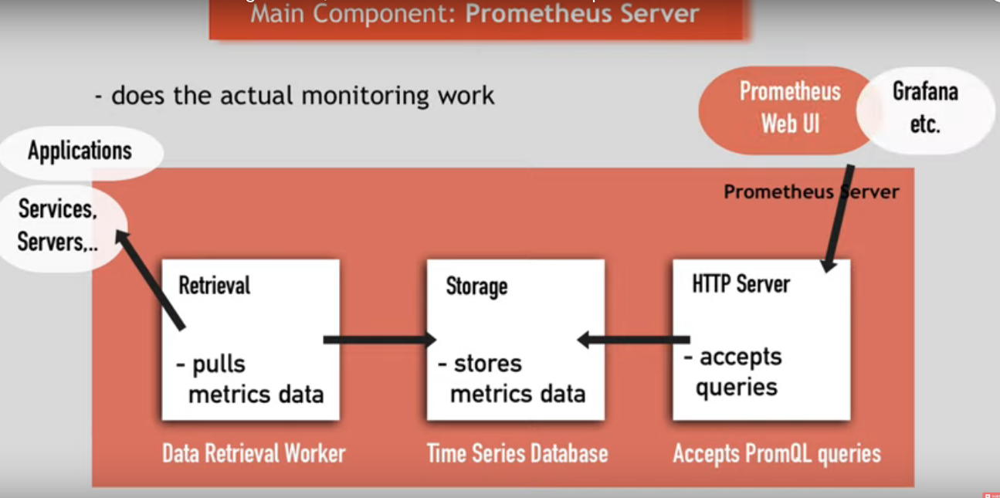
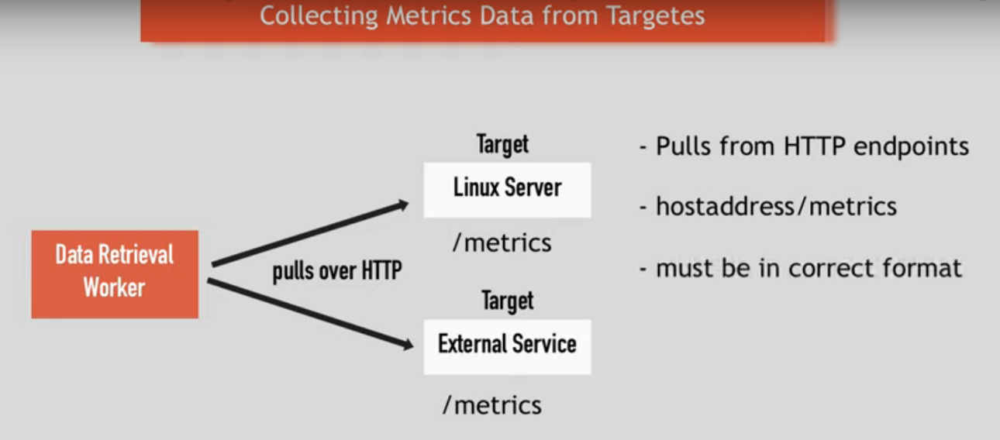

# Prometheus
===================

## Architecture


## Components

The Prometheus ecosystem consists of multiple components, many of which are optional:

- the main Prometheus server which scrapes and stores time series data
- client libraries for instrumenting application code
- a push gateway for supporting short-lived jobs
- special-purpose exporters for services like HAProxy, StatsD, Graphite, etc.
- an alertmanager to handle alerts
- various support tools


### Main Component: Prometheus Server




### Metrics:

- Format: **Human-readable** text-based
- Metrics entries: **TYPE** and **HELP** attributes

**HELP** : Description of what the metrics is

**TYPE**: One of 3 following type:

    - 1. Counter: How many times x happened?
    - 2. Gauge: What is the current value of x now?
    - 3. Histogram: How long or how big?


### Collecting Metrics Data from Targets




## Target Endpoints and Exporters

- Collects metrics using HTTP request (PULL method).
- Many have build in promethus endpoint.
- For those service not having endpoint, use exporters

### Exporter

These are script or services that:

1. Fetches metrics
2. Converts to correct format
3. Expose /metrics

Exporter list [Here](https://prometheus.io/docs/instrumenting/exporters/). Exporter are also available as docker images:

- Download exporter
- Untar and execute
- converts metrics of the server
- exposes /metrics endpoint
- configure Prometheus to scrape this endpoint

### Monitoring your own applications

Using [client libraries](https://prometheus.io/docs/instrumenting/clientlibs/) you can expose /metrics endpoint


### Pushgateway:

For **"short-lived job"**: push metrics at exit


## Configuring Prometheus

> prometheus.yml


## Alert Manager

- push alerts to **Alertmanager** which notifies users through *email*, *slack channel*, etc..

## Data Storage

- Stores metrics data in disk
- Stored in custom time series format

## PromQL

- Query target directly

e.g.: 

`http_requests_total{status!="4.."}` : Query all HTTP status codes except 4xx ones

`rate(http_requests_total[5m])[30m:]` : Returns the 5-minute rate of the http_requests_total metric for the past 30mins

================================================


# Part 2

================================================

## Installation

Installation from [here](https://prometheus.io/download)

Setup guides are defined [here](https://prometheus.io/docs/introduction/first_steps/)

## Data Model

### Metric names and labels

Every time series is uniquely identified by its metric name and optional key-value pairs called labels.

It must match the regex `[a-zA-Z_:][a-zA-Z0-9_:]*`

### Notation

> `<metric name>{<label name>=<label value>, ...}`
    
e.g: `api_http_requests_total{method="POST", handler="/messages"}`


## Metric Types

### 1. Counter

A counter is a cumulative metric that represents a single monotonically increasing counter whose value can only increase or be reset to zero on restart. For example, you can use a counter to represent the number of requests served, tasks completed, or errors.

```
from prometheus_client import Counter
c = Counter('my_failures', 'Description of counter')
c.inc()     # Increment by 1
c.inc(1.6)  # Increment by given value
```

### 2. Gauge

A gauge is a metric that represents a single numerical value that can arbitrarily go up and down.

```
from prometheus_client import Gauge
g = Gauge('my_inprogress_requests', 'Description of gauge')
g.inc()      # Increment by 1
g.dec(10)    # Decrement by given value
g.set(4.2)   # Set to a given value
```
### 3. Histogram

A histogram samples observations (usually things like request durations or response sizes) and counts them in configurable buckets. It also provides a sum of all observed values.

```
from prometheus_client import Histogram
h = Histogram('request_latency_seconds', 'Description of histogram')
h.observe(4.7)    # Observe 4.7 (seconds in this case)
```

### 4. Summary

Similar to a histogram, a summary samples observations (usually things like request durations and response sizes). While it also provides a total count of observations and a sum of all observed values, it calculates configurable quantiles over a sliding time window.

```
from prometheus_client import Summary
s = Summary('request_latency_seconds', 'Description of summary')
s.observe(4.7)    # Observe 4.7 (seconds in this case)
```

**More on code samples available at [prometheus/client_python](https://github.com/prometheus/client_python)**


## Rules

### 1. Recording rules:

```
# The name of the group. Must be unique within a file.
name: <string>

# How often rules in the group are evaluated.
[ interval: <duration> | default = global.evaluation_interval ]

rules:
    # The name of the time series to output to. Must be a valid metric name.
    record: <string>

    # The PromQL expression to evaluate. Every evaluation cycle this is
    # evaluated at the current time, and the result recorded as a new set of
    # time series with the metric name as given by 'record'.
    expr: <string>

    # Labels to add or overwrite before storing the result.
    labels:
        [ <labelname>: <labelvalue> ]
```

e.g:

```
groups:
  - name: example
    rules:
    - record: job:http_inprogress_requests:sum
      expr: sum by (job) (http_inprogress_requests)
```

## 2. Alerting rules

```
# The name of the alert. Must be a valid label value.
alert: <string>

# The PromQL expression to evaluate. Every evaluation cycle this is
# evaluated at the current time, and all resultant time series become
# pending/firing alerts.
expr: <string>

# Alerts are considered firing once they have been returned for this long.
# Alerts which have not yet fired for long enough are considered pending.
[ for: <duration> | default = 0s ]

# Labels to add or overwrite for each alert.
labels:
  [ <labelname>: <tmpl_string> ]

# Annotations to add to each alert.
annotations:
  [ <labelname>: <tmpl_string> ]
```
e.g:

```
groups:
- name: example
  rules:
  - alert: HighRequestLatency
    expr: job:request_latency_seconds:mean5m{job="myjob"} > 0.5
    for: 10m
    labels:
      severity: page
    annotations:
      summary: High request latency
```

## Querying Prometheus (PromQL)

### Expression language data types 

In Prometheus's expression language, an expression or sub-expression can evaluate to one of four types:

    o Instant vector - a set of time series containing a single sample for each time series, all sharing the same timestamp
    o Range vector - a set of time series containing a range of data points over time for each time series
    o Scalar - a simple numeric floating point value
    o String - a simple string value; currently unused

It is also possible to negatively match a label value, or to match label values against regular expressions. The following label matching operators exist:

    =: Select labels that are exactly equal to the provided string.
    !=: Select labels that are not equal to the provided string.
    =~: Select labels that regex-match the provided string.
    !~: Select labels that do not regex-match the provided string.

Label matchers can also be applied to metric names by matching against the internal __name__ label.

> {__name__=~"job:.*"}

** Range Vector Selectors **

> http_requests_total{job="prometheus"}[5m]

** Offset modifier **

> http_requests_total offset 5m


## Prometheus API

> http://localhost:9090/api/v1/query?query=...

Returns data in json

More detail in [here](https://prometheus.io/docs/prometheus/latest/querying/api/)

### Free prometheus / grafana: [robustperception](demo.robustperception.io)


## Exporter

### Starting pgbouncer exporter:

> ./pgbouncer_exporter --pgBouncer.connectionString="postgres://postgres:@localhost:6432/pgbouncer?sslmode=disable"

###  Exporter for [nginx](https://github.com/nginxinc/nginx-prometheus-exporter)

Blog [here](https://blog.ruanbekker.com/blog/2020/04/25/nginx-metrics-on-prometheus-with-the-nginx-log-exporter/)

Configuration for exporter:

```
listen:
  port: 4040
  address: "127.0.0.1"

consul:
  enable: false

namespaces:
  - name: nginx
#    format: "$remote_addr - $remote_user [$time_local] \"$request\" $status $body_bytes_sent \"$http_referer\" \"$http_user_agent\" \"$http_x_forwarded_for\""
    format: "$remote_addr - $remote_user [$time_local] \"$request\" $status $body_bytes_sent \"$http_referer\" \"$http_user_agent\""
    source:
      files:
        - /var/log/nginx/access.log
    labels:
      service: "nginx_app"
      environment: "development"
      hostname: "localhost"
    histogram_buckets: [.005, .01, .025, .05, .1, .25, .5, 1, 2.5, 5, 10]
```


# AlertManager

### Grouping

Grouping categorizes alerts of similar nature into a single notification. This is especially useful during larger outages when many systems fail at once and hundreds to thousands of alerts may be firing simultaneously.

### Inhibition

Inhibition is a concept of suppressing notifications for certain alerts if certain other alerts are already firing.

### Silences

Silences are a straightforward way to simply mute alerts for a given time.

### Client behavior

The Alertmanager has special requirements for behavior of its client. Those are only relevant for advanced use cases where Prometheus is not used to send alerts.

### High Availability

Alertmanager supports configuration to create a cluster for high availability. This can be configured using the --cluster-* flags.

Step by step tutorial [here](https://grafana.com/blog/2020/02/25/step-by-step-guide-to-setting-up-prometheus-alertmanager-with-slack-pagerduty-and-gmail/)


## Configuration

Question for multiple receiver [here](https://stackoverflow.com/questions/64595610/alertmanager-webhook-does-not-work-when-defined-on-its-own)

### 
